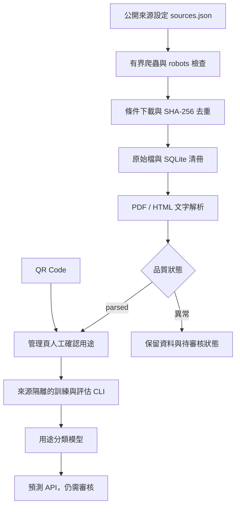

# README_總體架構 — 設計概念

本文件說明為什麼做、做什麼、如何驗收。操作與檔案定位見 [技術維護 WIKI](README_技術維護.md)，需求歷史與交接見 [AGENTS.md](AGENTS.md)。

## 產品定位

水泥知識文件工作台：以 QR Code 作為知識集合入口，用自行訓練的單任務分類模型，協助公開文件的用途辨識與後續處理分流。

求職展示重點是 Python／JavaScript 全端、資料取得、可重跑流程、模型評估與可交接文件。QR 是集合入口；不把 QR 包裝成本身具有語意理解能力。

## 問題與範圍

大量文件全交給 LLM，會增加額度消耗與流程管理難度。全量解析、切塊、向量化也有前置成本。長期目標是面對 1–2 TB 時，先以較便宜的清冊、分類與索引找到候選，再投入語意分析資源。

目前是三天原型的最小基礎，沒有 TB 實測。原始位元組數不等於 token 量；應按檔案數、頁数、影像比例、文字量與更新頻率估算。向量庫可以增量更新，難點是變更偵測與資料生命週期管理。

## 已實作資料流

爬蟲、解析與訓練目前用 CLI 手動串接。管理頁沒有上傳、啟動爬蟲或一鍵訓練功能；模型也尚未自動對全庫分類。

## 分類契約

| 標籤 | 主要用途 | 後續可用處理（規劃） |
|---|---|---|
| research | 研究、機理、實驗與綜述 | 擷取研究問題、條件、材料、結果、引用 |
| manual | 軟體、工具、操作指南 | 擷取步驟、參數、輸入與輸出 |
| guidance | 工程選材、應用指引 | 擷取適用條件、限制與工程建議 |
| safety | SDS 等安全資料 | 產品識別、版本與安全欄位索引 |
| industry | 產業、政策路徑、永續報告 | 組織、年度、指標、目標與實績 |

分類依主要用途，不依副檔名或機構名稱。綜合文件無法明確判定時保留待確認。guidance 不等於法規或強制標準；缺少某類樣本時應擴充資料，不偽造真值。

用途、主題、時間是不同維度：用途由模型負責；材料與組織等實體、主題詞、出版日期、版本等欄位是後續結構化資訊。第一版沒有這些完整欄位。

## 模型選擇與品質

基準模型為字元 TF-IDF（2–4 gram）加 Logistic Regression，從文件解析文字取首、中、尾約 18,000 字元。可在 CPU 使用，不涉及生成式小型語言模型微調。

資料來源的 suggested_label 只供參考；人工 label 與 parsed 狀態共同決定訓練資格。跨來源測試可減少機構／版型偏差，但仍需人工管理近似文件與版本群組。混合中英文不代表已具跨語言泛化能力。

預測分數未校準，不能稱為正確機率；API 固定要求審核。尚未設定自動略過或送交 LLM 的門檻。

## 公開資料策略

種子來源含 NIST、FHWA、Cemex、台泥、IEA，網址與範圍由 sources.json 管理。公開可讀不等於自由散布。保留來源與授權說明，下載內容不提交 Git。

實抓曾發現：存取挑戰頁也可能回 HTTP 200、PDF 中繼標題可能錯誤、同網域可能放不同公司報告。必須預覽內容並保留品質狀態。來源細節及更正記錄見 [VALIDATION.md](VALIDATION.md)。

## 時間與語意關係（後續設計）

| 關係 | 建立依據 | 邊界 |
|---|---|---|
| 同系列跨年 | 同組織、系列與年份 | 可作時間軸，不代表版本替代 |
| 新版取代 | 編號、版次及明確替代聲明 | 日期較新不足以成立 |
| 引用 | DOI、報告編號、參考文獻 | 原文可驗證 |
| 共同主題 | 領域詞、實體、候選語意分數 | 先標為候選相關 |
| 支持／反駁 | 主張、試驗條件與證據片段 | 需深入判讀，不能只看相似度 |
| 指標時間變化 | 同定義、單位、組織範圍 | 實績、預測、目標分開 |

水泥領域應區分出版日期、報告年度、目標年度、養護齡期（7 天／28 天），不能混成同一時間欄位。

每條正式關係規劃保存來源 ID、頁碼／段落、證據、擷取方法與審核狀態。跨文件比較先縮小候選，避免全體兩兩配對；單份文件抽取之後仍需實體對齊。現行只保存頁碼文字，未建關係表。

## 增量與檢索路線（後續）

先做清冊與變更偵測，建立中繼資料／關鍵字索引，再依查詢取得候選。只對需要的片段向量化、重排序或交給 LLM；保留跨類別搜尋，避免分類漏判造成永久漏檢。

當前 SHA-256 去重與 ETag／Last-Modified 只能提供基礎增量。完整版本關係、搬移辨識、刪除同步、片段差異、解析器／模型版本與依賴失效仍需擴充。

LLM 階段規劃為獨立任務，每次帶固定指令、結構化輸出契約和必要片段，結果存入外部狀態，支援重試。這才處理長對話指令遺失問題。当前沒有 LLM 或任務佇列。

## 驗收與三天優先序

第一天：來源、解析、分類定義與資料標註基礎。第二天：清冊、管理頁、基準模型與增量驗證。第三天：完成測試、文件與 QR Demo；有餘裕才加入少量關係展示。這是規劃，不代表各階段已全部完成。

目前驗收：爬蟲可執行、保存來源與原文、解析異常隔離、標註 API、訓練與預測程式往返測試、QR 入口。真實模型仍需資料。

後續成效應比較人工規則、模型分流與全面處理：Macro-F1、各類召回率、應處理文件保留率、檢索品質、待確認比例、解析／embedding／LLM 用量、處理延遲及增量耗時。節省量需與保留率一起呈現；估算與實測分開。

本機版本無登入與權限隔離，不直接公開部署；手機展示需可達網址，localhost QR 僅供同機使用。

## 資料擴量規劃更新（2026-09-12）

訓練資料擬採人工確認與名詞映射弱標籤約 2:8，獨立人工驗證及測試另計。見 [資料規劃](docs/訓練資料2比8規劃.md)。此為待實作弱監督方案，既有來源建議標籤不直接當真值。

## 弱標籤原型落地（2026-09-12）

文獻查核未找到直接適用的固定比例，維持 2:8 作初始配置。已實作詞彙規則候選、棄權及獨立紀錄；不等同已訓練混合模型。見 [研究與落地紀錄](docs/弱監督比例研究.md)。

## 設計決策與研究依據（2026-09-12）

後續重要設計決策先查找適用研究，記錄來源、結果與本案的適用限制。若沒有直接研究依據，再依現有資料、實測、成本與三天原型限制判斷；明確列為工程假設，不包裝為研究結論。

### D-001：人工／弱標籤訓練資料維持約 2:8

| 項目 | 決策內容 |
|---|---|
| 問題 | 水泥用途分類是否有適用的人工／自動篩選資料建議比例？ |
| 研究查核 | 查找 Snorkel、WRENCH、領域分類及 gold/silver 資料研究，未找到可直接套用本案的固定比例；不表示所有研究皆無建議 |
| 採用方案 | 訓練資料約 20% 人工確認＋80% 規則弱標籤；獨立人工驗證與測試另計 |
| 直接決策依據 | 使用者原先比例規劃，以及缺乏可取代原案的直接研究證據；非研究證實最優，也非現有樣本驗證最優 |
| 本地證據 | 2026-09-12 既有 7 筆記錄：候選 1、棄權 2、跳過 4；只證明流程可運作，數量不足以驗證比例或精確率 |
| 暫定參數 | 250 份訓練目標、90% 抽驗目標、規則分數與差距門檻均屬工程假設，未由文獻或充分本地評估確認 |
| 驗證方式 | 相同人工測試集比較人工基準、規則基準與混合模型；以驗證集選比例與權重，測試集不參與調整 |
| 重新評估條件 | 新研究可直接適用、抽驗顯示高雜訊、類別覆蓋不足，或混合模型未改善人工基準時，調整比例／規則，不為湊數強制分類 |

研究來源與可支持範圍：

- [Snorkel 論文](https://arxiv.org/abs/1711.10160)：支持以程式化弱監督建立訓練訊號，不支持「2:8 最佳」；[官方教學](https://snorkelproject.org/use-cases/01-spam-tutorial/)說明人工開發／驗證資料的角色。
- [WRENCH 論文](https://arxiv.org/abs/2109.11377)：提供跨任務弱監督評估框架，不能把 train/validation/test 的數量當成本案人工／弱標籤比例。
- [Clinical Data Generation 研究](https://pmc.ncbi.nlm.nih.gov/articles/PMC10782150/)：某類別加入四倍 silver 仍未改善，僅作資料品質／任務差異的間接參考；非水泥領域且標註方法不同，相關分析僅由搜尋索引核對，全文未完整查核。

完整查核範圍與其他參考見 [研究紀錄](docs/弱監督比例研究.md)。九項測試通過是功能驗證，不能作為模型準確率或資料比例依據。

## D-002：人工審核先行與群組隔離（2026-09-12）

依 Snorkel 的獨立人工評估設計與 scikit-learn 的群組隔離原則，新增審核交換與資料集草稿。現有三份 parsed、無人工真值，因此先不混合訓練；hash 防過期與原子匯入屬本地工程設計。研究來源、未採方案與重評條件見 [D-002 詳細紀錄](docs/人工審核與資料集.md)。

## 資料擴充與決策 D-003（2026-09-12）

目前 13 份文件中 8 份可解析，5 份弱標籤候選，仍零人工標註；2:8 尚未達成。新增安全資料、手冊與年度／永續報告，保留時間／文件家族關係候選，尚未建立知識圖譜。詳見 [來源、結果與後續用途](docs/資料擴充20260912.md)。

D-003 依 pypdf 官方 AES 安裝說明與本地解析失敗，補齊 crypto extra 並支援單文件重試；兩份報告已成功解析。這是可追溯維護決策，不是分類效能研究。D-001／D-002 保持不變；候選不等於真值，資料集仍為草稿。

## 人工閱讀包（2026-09-12）

新增 cement/review_pack.py，將既有審核 JSON 分成逐份含頁碼全文與精簡 answers.json。實際輸出 data/reviews/reading-pack-20260912-01/，8 份文件、人工欄位保持空白；原始審核包與資料庫未改動。入口為該目錄 README.md。

此為 D-002 審核工作流程的呈現改善，沿用既有獨立人工評估與群組隔離依據；不是新的比例、模型或有效性決策，未主張提高標註品質。工作包不呈現弱標籤建議／證據，避免自動候選直接影響填寫。全文仍需人判讀，未分組資料不自動決定 split。

15 項功能測試通過；新增測試涵蓋精簡欄位匯入、空白跳過、原檔保護、不顯示弱建議及全文 HTML 轉義。首次測試發現 Windows 預設 cp950 讀取問題，測試改為明確 UTF-8 後通過。仍零人工真值，沒有新增模型。

## 加速標註評估（2026-09-12）

使用者要求評估比逐份人工標註更快速可靠的方式。研究、適用限制與驗證設計見 [加速標註方案評估](docs/加速標註方案評估.md)。D-004 為提案：優先多證據程式化弱標註＋衝突審核＋分層隨機抽驗，可選有限 LLM 教師，主動學習待有模型及足夠資料後比較。沒有研究證明本案可無條件取代人工或固定最佳比例；2:8 維持規劃，獨立人工評估另計。

本輪僅研究及文件更新，未新增標籤、API 標註呼叫或訓練；既有人工工作包保持。新流程須保留真值／弱標籤區別，不能以此提案绕過未完成的弱標籤抽驗。

## 輔助審核 UI（2026-09-12）

完成 /review 片段／全文預覽、用途單選、跳過及儲存下一份。新增 review GET/POST API，與 CLI 共用 import_rows 稽核。人工真值未代填；16 項測試通過。操作與限制見 README_技術維護.md「輔助審核頁面」。此節取代舊版「沒有審核 API／UI」描述；混合訓練仍未完成。

## 首批人工判讀結果（2026-09-12）

使用者回報已判斷 8 份，幾乎可從標題或擷取片段中的關鍵字判斷。資料庫核對 reviewer=pososos 的 8 份已儲存：manual 2、industry 2、safety 2、research 1、guidance 1。先前「零人工真值」快照已過時。

既有規則的 5 份候選與人工結果有 4 份一致、1 份不一致，另 3 份棄權。不一致的是 FHWA-HRT-23-104: Portland Limestone Cement：人工 research、規則 guidance。保留人工判斷，不自動覆寫；後續應釐清研究與工程指引的分類邊界。這是同批開發資料的描述性比較，不是獨立測試準確率。審核 note 空白，系統未記錄判讀耗時或實際閱讀範圍，因此不能聲稱已測出片段分類正確率或成本節省。

使用者觀察支持先試驗「文件內容標題／首頁文字＋局部片段，證據不足再擴展全文」的分階段輸入；目前僅作本地假設，沿用 D-004 提案，沒有研究宣稱八份可證實泛化。PDF metadata title 多份為空，且部分與正文用途不一致，不能只用清冊 title 欄位。現行解析仍讀全文，預覽節錄不等於已降低 PDF 解析成本。

已產出 data/reports/dataset-after-human-20260912-01.json；仍為草稿、training_ready=false。下一個驗證應以這批作開發，比較首頁／片段／全文的規則輸出與人工結果，保存證據及讀取字量；另收獨立來源檢驗泛化。未修改規則或模型，未覆寫人工標籤。

## 人工修正與棄權分析（2026-09-12）

依使用者更正 Portland Limestone Cement 為 guidance，已透過既有稽核匯入器寫入並保存理由；人工 research 現為 0。三份棄權中兩份由全文旁支主題造成多類衝突，一份因缺少 support 完整詞命中。保持規則不變改用前三個非空頁，前兩份轉為與人工一致的候選，另一份仍棄權。詳見 [三份棄權分析](docs/三份棄權分析.md)。這是本地開發資料診斷，正式規則未修改，不是獨立成效驗證。

## D-005 多語言檢索分類（2026-09-12，提案）

評估 embedding＋reranker 可作類別描述／代表範例分類；五類先比較 embedding 全類別與 reranker 全類別，之後才評估按難例啟用。無須全量向量庫。相關性不是用途真值，直接使用預訓練模型不等於自訓；後續可凍結 encoder 自訓分類頭。研究來源、成本、增量快取與資料限制見 [多語言檢索分類評估](docs/多語言檢索分類評估.md)。本輪未安裝或訓練模型，未修改規則／資料標籤。

## 中英文來源擴充（2026-09-12）

使用者要求來源同時包含中文與英文；後續收集與評估需按語言及用途檢查缺口，不能以同一文件翻譯本充作獨立樣本。

本批 6 來源，5 下載成功、1 因國土管理署 robots HTTP 302 停止。成功取得中文台泥安全資料表、中文建研所混凝土收縮研究摘要頁、中文水利署結構用混凝土規範頁、英文 NIST 水灰比／水化研究摘要頁、英文 NIST Drying/hydration PDF。最後一份僅封面 617 字，後九頁無文字，已從 parsed 改 needs_review 並記錄品質事件，不列可審核樣本。兩份研究網頁是摘要，不冒稱全文；HTML 尚有導覽文字，應改善正文提取後再作片段模型比較。

來源可重跑設定為 config/sources-bilingual-20260912.json 與 config/sources-bilingual-followup-20260912.json，已併入 sources.json。language_hint 為來源設定提示；data/reports/bilingual-sources-20260912.json 記錄本次正文語言抽查與內容範圍，未新增資料庫語言欄位，也未代填人工用途。新資料有中文 3、英文 1 份通過現行解析檢查；人工仍需判讀。

全庫 18 份：parsed 12、needs_review 3、needs_ocr 1、blocked_content 1、out_of_scope 1。既有八份人工標籤保留；新四份尚未標註。data/reviews/bilingual-new-only-20260912.json 為僅新四份審核包；batch-bilingual-20260912.json 為 12 份完整匯出。審核頁重新整理可見新文件。本輪沿用既有爬蟲與弱規則，未更改模型或執行測試套件；未安裝 embedding/reranker。下一步先處理 HTML 導覽干擾，再做 D-005 離線比較；中英文五類分布仍未補齊。

cement-crawl 全域 Skill 仍有舊入口名稱，但使用者已要求合併，實際以本專案 AGENTS.md 為準；本輪未修改全域 Skill。

## HTML 正文清理（2026-09-12）

新增 parse.extract_html：按已核對的 NIST / ABRI / WRA 主機選正文區，保留分行。ABRI 同時擷取 CCMS_Content 與 page-footer，避免漏掉摘要；已知版型缺區塊則報錯。保留包住正文的 ASP.NET form，避免清除整份文件。此為原始 HTML 結構的本地實測修正，不新增模型選擇研究結論。

三份網頁已定向重解析，原文保存在 data/text-history/*-before-body-clean.json。首次執行曾因 form 祖先被移除產生空正文，已修復並補測，最終三份皆 parsed；以 data/reports/html-body-clean-final-20260912.json 為最終結果，早期報告保留失敗記錄。19 項測試通過。

使用者已完成新增文件標註，這次讀取發現三份網頁也已有人審。保留所有人工 label，不代為確認新文字；三份文字 hash 改變，membership 需經 UI 重新確認儲存後才恢復有效。既有開啟頁面會以版本衝突阻止過期提交，請重新選取文件。最終審核包 batch-body-clean-final-20260912.json；dataset-body-clean-20260912.json 保存失效檢查。先前 batch-body-clean-20260912.json 是修復前中間產物，不作最新審核入口。

未安裝語意模型；下一階段才做類別描述 embedding／reranker 比較。原始下載保留，清理不改人工用途與資料切分。

## 語意模型實測與圖譜銜接（2026-09-12）

已完成 E5-small 與 bge-reranker-v2-m3 十二份離線比較，固定 revision／雙語類別描述／前 1,500 字／512 tokens，CPU 4 threads。有效審核九份兩模型皆 7/9 與人工一致，兩份手冊仍誤判。三份正文更新的人工標籤保留但不計指標；reranker 對這兩份研究摘要的預測與舊人工標籤一致，但尚不作有效评估。CPU 每份中位數 E5 0.106 秒、reranker 3.837 秒；少量單次實測，不是泛化準確率或 TB 吞吐。暫不推薦全量 reranker。詳見 docs/語意分類實測20260912.md 與 docs/語意分類實驗操作.md。

新增 cement/semantic_benchmark.py、semantic_summary.py、config/semantic-labels.json、semantic-models.json，requirements-semantic.txt／requirements-semantic.lock.txt；原工作台相依檔保留。模型檔位於 data/model-cache 與 data/reranker-fixed，約數 GB，未建向量庫。Hub reranker 下載停滯後改用相同 revision HTTPS 串流完成。20 項功能測試通過；模型已實際推論，未自訓、未寫入正式 label 或正式預測 API。

使用者追加知識圖譜須連結事件、原因、結果／結論，並可延伸 tag。D-006 依 PROV-O、SKOS 與事件時間／因果研究作設計，詳見 docs/知識圖譜銜接設計.md。原文因果主張與模型推論、時間前後、語意相似分開；tag 支援雙語別名、上位／相關概念與版本。現行較早「知識圖譜留待後續」不代表禁止這次明確要求的銜接設計。

已新增 config/graph-contract.json（設計契約，非驗證器）、cement/graph_handoff.py，匯出 data/reports/graph-handoff-20260912.json：12 文件版本、19 帶 hash／頁碼／字元定位的原文片段，全部引文定位核對通過。事件／關係／tag 尚未抽取，空陣列不代表完整圖譜。CLI：`.venv/Scripts/python.exe -m cement.graph_handoff --output data/reports/new-graph-input.json`。輸出禁止覆寫；用途分類不是唯一抽取閘門。下一步先改善手冊與研究／指引邊界，再實作單文件事件主張候選與證據審核；跨文件合併、因果驗證、圖 UI 尚未完成。

## 標題 → 目錄 → 內容與級聯門檻（2026-09-12）

使用者明確要求判斷順序為標題、目錄、最後內容，避免大量正文干擾。已新增 cement/staged_classification.py 離線流程，各階段獨立 embedding → 未達門檻才 reranker → 再未達才下階段 → 最後棄權；沒有正式自動套用最佳門檻。

最終 data/reports/staged-02：96 組門檻。有效九份標題 embedding 9/9、標題 reranker 5/9；E5 0.75／差距0 全部直接採 embedding，9/9、零 reranker；E5 0.8／0.02＋reranker logit0／差距1 為6/9、三誤判、六次 reranker（全部12份）。嚴格0.9／0.1＋2／2為三一致、一誤判、五棄權。這是同批調參，不能稱跨語言五類泛化準確率；有效研究類仍缺，原三份失效審核保留但不計指標。

詳見 docs/標題優先與級聯門檻實測.md。22 項測試通過；人工標籤與線上 API 不變。下一階段必須維持標題優先方向，但對模糊標題應保留目錄／正文升級與棄權；尚未驗證的新路由不可宣稱已完成。圖譜抽取仍需要按關係證據追加正文，分類少讀不等於圖譜可以只讀標題。

## 七類用途與僅內容重排（2026-09-12）

使用者要求 reranker 放在內容階段，新增實驗記錄 experiment_log 與手稿筆記 manuscript_notes。已同步 store、API、兩個頁面、閱讀包、語意描述與詞彙規則（v2）；原人工標籤保留。新路由為標題 E5 → 目錄 E5 → 內容 E5 → 僅內容 reranker → 棄權；缺標題／目錄可略過。reranker 是否提升內容分類仍需實測，不把需求描述當研究成效結論。

已跑七類 96 組，data/reports/staged-seven-body-reranker-01/；有效九份：E5 0.75/差距0 時9一致、0棄權、0次重排；0.8/0.02＋重排0/1時8一致、0誤判、1棄權，全部12份共3次內容重排；0.9/0.1＋2/2時1一致、8棄權。僅作同批開發診斷，與前版同時改了類別數及路由，不能視為單變量因果實驗。兩個新類無人工真值，不能聲稱七類準確率。已確認所有標題／目錄階段沒有 reranker 分數。

23 項測試通過，JS 語法通過；localhost:8011 已重啟，重新整理可見七類。沿用每類65份規劃，總需求455，新類目前剩餘各65；此為配額延伸，非研究最佳值。詳見 docs/七類用途與內容階段重排.md。手稿筆記不等於必須手寫，掃描手寫 OCR 未實作。圖譜上實驗記錄可提供條件／事件／量測，手稿主張保留草稿與推測狀態。

## 配額收集實測（2026-09-13）
全庫317份，parsed255；本批可解析PDF候選研究37、工程指引38、產業27、SDS52，尚非人工確認或獨立樣本。455份未蒐集齊，手冊／實驗記錄／筆記缺口最大。僅後兩類獲准擴至土木／建材，另註domain。MIT筆記因掃描／印刷插頁需OCR或品質審查；iGEM日誌robots403未下載。新增兩個來源發現腳本及唯讀稽核報告，配置已合併sources.json。詳見 [配額資源蒐集實測](docs/配額資源蒐集20260913.md)。23項測試通過，未動人工標籤或訓練。

## 第二批資源擴充（2026-09-13）
新增15份設備手冊、5份試驗報告、13份原始TXT量測記錄可解析，另10份目錄排除。全庫360、parsed288；455份合格獨立樣本仍未齊，本批英文。TXT由已核對ZIP有界匯入，來源與同實驗家族見data/reports/experiment-members-20260913.json，不能跨split拆開。新增TXT解析與429同次爬蟲主機暫停，25項測試通過。Humboldt本輪已限流，不立即另起程序重試。詳見 [收集實測](docs/配額資源蒐集20260913.md) 第二批章節。

## 第三批資源擴充（2026-09-13）
新增78份英文量測TXT、1份中文實測、3份中文材料使用PDF可解析；1份掃描待OCR、2入口排除。全庫445，parsed370；不是455合格樣本只差10份，仍有用途、群組與人工審核缺口。Hannover七實驗室共91份TXT屬同研究家族，不跨split任意拆開。新增collect_fatigue_labs及參數化封包匯入、完整預檢，三個已核對封包採10MiB單檔上限，總量仍25MiB。26項測試通過。最新collection-third／dataset-third／quota-third報告，細節見 [收集實測](docs/配額資源蒐集20260913.md) 第三批。

## 第四批與課堂筆記授權（2026-09-13）
使用者允許手稿筆記納入課堂筆記、講義與投影片，來源子類另標記；取代早先僅未完成草稿限制。config/source-subtypes.json→API source_metadata→審核頁顯示，不是人工標籤。課程群組與OCR限制保留。全庫491、parsed392；候選檔案研究37／手冊18／指引42／SDS55／產業31／實驗97／筆記19，配額仍未齊。semantic-labels與term_mapping升v3，尚未重跑模型或弱標註，旧指標只適用舊定義。26測試及JS語法通過，8011重啟。最新collection-balance-fourth-final及quota-fourth審核包；詳見 [收集實測](docs/配額資源蒐集20260913.md) 第四批。

## D-007 選樣偏差修正（2026-09-13）
使用者目標為公司／專案混合資料夾＋研究團隊資料庫（1+3，未指定比例）。停止以用途搜尋補配額作為評估來源；舊公共資料僅開發候選，不能重新宣稱新盲測。現庫513含中斷第五批已下載22份，未解析；無執行中爬蟲。來源高度綁定用途已稽核，見sampling-bias-20260913.json；未做近似重複／捷徑模型實測。新增local_inventory與evaluation_intake支援本機固定快照、全檔案清冊、固定seed、拒收曝光內容與用途欄位；尚需使用者提供真實資料快照路徑，未建代表性測試集。30項測試通過。研究依據、限制及操作見 [選樣偏差與混合資料庫評估](docs/選樣偏差與混合資料庫評估.md)。

## D-008 雙軌推進與配額延後（2026-09-13）
使用者確認在真實公司/研究資料夾快照未提供前，改採雙軌推進：功能與流程驗證（不涉分類成效）＋既有公開資料小規模開發與弱點壓力測試（不再以補滿455份配額為推進前提）。自訓模型仍為交付目標，七類完整成效與455份配額延後而非取消；小樣本診斷需與功能驗證、未來獨立測試分開報告，不得互相取代或冒充代表性成效。D-007的真實資料夾與獨立測試集要求不變，一旦取得快照路徑即切回該流程。研究依據、本地證據與重評估條件見 [雙軌推進與配額延後評估](docs/雙軌推進與配額延後評估.md)。本輪僅文件與決策更新，未新增程式或測試，未變更既有資料或人工標籤。

## D-008 執行：軌道一與軌道二首次結果（2026-09-13）

軌道一：重跑既有 pytest 全套（30 項）通過，確認 crawl→parse→標註→來源隔離訓練/評估 CLI→API 流程在現有公開資料上可重現；未新增功能。

軌道二：既有 12 份人工標籤（涵蓋 guidance／industry／manual／research／safety 五類，experiment_log／manuscript_notes 尚無人工標籤）在不動 dataset_membership 既有凍結（group_id=分類測試、split=validation）的前提下，直接用 `cement.train --holdout-sources` 做每類各留一個來源的隔離測試（7 訓練、5 測試）。結果 macro-F1 0.4；兩份中文測試文件被誤判為訓練集中唯一的中文類別（research），一份英文 research 測試文件被誤判為訓練集英文樣本最多的類別（guidance）。這只證明流程可運作、並用小樣本重現了「混合中英文不代表已具跨語言泛化能力」的既有警語，不是任何類別的可靠成效數字（n=12，各類訓練樣本僅1–2份）。詳見 [軌道二來源隔離小樣本診斷](docs/軌道二來源隔離小樣本診斷20260913.md)。

## 關鍵字索引、處理政策與圖譜候選審核（2026-09-13）

人工標註暫緩期間，先完成 AGENTS.md 待辦中不需要新標註的項目：關鍵字索引、處理政策、文件版本關係，以及 D-006（知識圖譜銜接）單文件規則式候選抽取與人工審核。三者均為既有規劃項目的實作進度，非新決策；操作、API、資料表細節見 [README_技術維護.md](README_技術維護.md#關鍵字索引處理政策與圖譜候選審核2026-09-13)。

關鍵字搜尋刻意不以 label 篩選，未標註文件也能被搜到，落實「分類不可成唯一檢索閘門」；處理政策與版本／系列關係都要求明確設定者，不從標籤或發布日期自動推定。D-006 候選抽取沿用既有規則式（非 LLM）路線，因果詞命中只產生待人工判斷的候選句，assertion_mode 固定 explicit_in_source，接受／拒絕前不算數，也還沒有拆成 Event/Condition/Outcome 等完整節點。37 項 pytest（含新增 7 項）通過；本機以既有 392 份 parsed 文件實測，並在瀏覽器中操作管理頁搜尋與圖譜候選接受流程確認可用，未修改既有人工標籤或訓練邏輯。

## 分頁、版本失效管理與跨文件候選關聯雛形（2026-09-13）

延續上節，補齊規模化（清冊／搜尋分頁）與 D-006 深化（跨文件候選關聯、圖 UI 雛形）兩項不需新人工標註的待辦。`store.documents`／`/api/documents`／`/api/search` 加選填分頁，預設行為不變，既有頁面與呼叫者不受影響。文件重新解析造成 text_hash 改變時，圖譜候選抽取會把舊版本尚未審核的 pending 候選自動標記 stale，已接受／拒絕的人工判斷維持為該版本的歷史紀錄，不自動覆寫或遷移。新增 `candidate_relations` 讓兩個已接受的候選可以互相標註 same_event_candidate／precedes／related——這只是「候選合併」，不是自動確認的事件合併，仍需人工核對實體、時間、地點／試體與條件；`/graph` 頁面用內建 SVG 畫出目前關聯當作圖 UI 雛形，不是正式圖資料庫。44 項 pytest（含新增 7 項）通過，操作、API、資料表細節見 [README_技術維護.md](README_技術維護.md#分頁版本失效管理與跨文件候選關聯雛形2026-09-13)。

## D-006 再深一層、時間軸、本機語意檢索（2026-09-13）

使用者明確要求擴張到時間軸、實體候選、局部向量化／排序、LLM 關係抽取；詢問後使用者選擇暫不做任何 LLM 相關程式，本輪只做非 LLM 部分。新增 Entity/Event/Condition/Outcome 節點分解、正式關係（依 graph-contract.json 完整契約欄位）、跨文件實體對齊（規則式候選＋人工明確連結，字串相同不自動合併）、SKOS-lite tag 詞彙表、時間軸（人工事件時間與抓取時間分開呈現，不合併成假精確的單一排序），全部是人工從已接受候選手動建立，不是自動抽取。

另新增本機語意檢索（複用 D-005 已驗證的 E5-small 方法，增量快取，可選 bge-reranker 重排序），與部分技術債：管理頁分頁、schema 遷移小工具、模型登錄／校準機制／預測延遲紀錄。54 項 pytest 通過；瀏覽器實測含真實模型推論的語意搜尋、跨文件實體對齊（同一實體正確對到 2 個不同文件版本）、節點分解與正式關係建立、tag broader 階層、時間軸分區顯示。過程中發現並修正一個真實前端 bug（實體連結後畫面更新順序寫反）。這些是候選／人工紀錄層級的能力擴充，不是完整知識圖譜或已驗證的檢索成效；限制與範圍見 [知識圖譜深化與語意檢索](docs/知識圖譜深化與語意檢索20260913.md)。

## 公開展示頁重新設計（2026-09-13）
依使用者要求，以「用途→互動使用→技術架構」重設 docs/index.html，樣式及行為拆至 docs/showcase.css、docs/showcase.js，無新增前端相依套件。首屏說明文件分類／人工確認／知識整理用途；七類教學示例、即時命中數、零命中／同分棄權、人工修正與後續處理建議在瀏覽器運行，確認僅存當次頁面、不寫本機資料庫。架構五階段可點選查看輸入／輸出／技術／原始碼，區分自訓基準、離線 E5 級聯實驗與公開簡化規則。保留7筆公開文件靜態快照與搜尋，移除原頁對未取得來源的概括描述。公開網址及 QR 不變；此次僅工作目錄修改，未推送部署。

驗證：node --check 通過；使用既有 Playwright＋無頭 Edge 驗證七類教學例、兩種棄權、人工修正、空輸入停用、重設、架構切換、搜尋及組合篩選，無 pageerror。390px viewport 無水平溢出；桌面1440px及手機截圖保存 data/reports/showcase-desktop.png、showcase-mobile.png。初次測試發現衝突例命中不平衡，修正後上述檢查通過。截圖檢視工具受沙箱 helper 故障阻擋，未完成截圖人工視覺核對。未改 Python、分類資料或人工標籤；未重跑後端54項測試，頁上54為既有歷史快照。

## 展示頁檔案上傳與模型說明（2026-09-13）
公開頁新增瀏覽器本機檔案讀取：PDF、UTF-8 TXT／MD／CSV，10 MiB 上限，前12,000字元；PDF最多前10頁，不含OCR。以固定PDF.js 4.10.38解析，模組／worker／Apache授權存docs/vendor/pdfjs，來源 https://cdn.jsdelivr.net/npm/pdfjs-dist@4.10.38/ ，API參考 https://mozilla.github.io/pdf.js/examples/ （本輪查核官方範例）。文件內容不送伺服器、不寫正式清冊。載入失敗清除舊結果；切換示例、重設或手動編輯使舊非同步結果失效。上傳後仍使用頁面簡化關鍵詞規則，不宣稱呼叫E5或自訓模型。
架構說明改用「多語言檢索模型把文件與用途描述轉向量找候選、重排模型逐對比較內容與候選」，保留標題優先及重排僅用於內容的設計。本機實驗與公開規則能力分開。
node語法與無頭Edge實測通過：文字檔、真實文字PDF、截斷、非法UTF-8、空檔、不支援副檔名、超大檔、損毀PDF、重設與模型說明。未改後端／資料，未推送公開頁。

## 系統架構圖展示（2026-09-13）
展示頁技術區新增明確架構：A公開GitHub Pages瀏覽器層、B本機JavaScript介面→HTTP/JSON→FastAPI→用途分類／雙路檢索／知識整理→SQLite及檔案儲存、C用途分類模型離線實驗。另畫CLI批次資料準備，標明非自動佇列、公開頁無本機API連線，圖譜使用SQLite並非另有圖資料庫。補上分類與檢索分離、人工證據關卡、新文件衍生資料更新的設計理由。保留可點選模組詳情與上傳體驗。此次為現有設計呈現，不改模型策略或後端。
驗證：無頭Edge檢查架構分層、三個服務區塊、模組切換；1440／390px皆無水平溢出。手機架構截圖data/reports/system-architecture-mobile.png。未推送公開頁。
