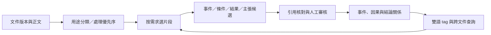

# 知識圖譜銜接：事件、原因、結論與可延伸 tag

2026-09-12；D-006。使用者新增需求：知識圖譜須連結事件、原因與結論，並以 tag 延伸。以下為後續設計；目前已實作原文交接輸出，尚未實作關係抽取、圖形 UI 或圖資料庫。

## 分類之後的流程

分類用來選策略與排優先序，不是唯一排除閘門。研究可優先方法／結果／結論；指引可優先適用條件／建議／限制；安全文件保留危害情境與處置；產業文件關注時間、組織、措施與績效。現有首段分類片段不一定涵蓋因果證據，圖譜抽取需要按目標追加正文，不能只重用首頁宣稱完成全文分析。

## 節點與關係

|節點|主要欄位與用途|
|---|---|
|DocumentVersion|document_id、text_hash、來源網址、出版日期（可空）；保存版本|
|Evidence|文件版本、頁碼、字元起訖、原文引文；HTML 頁碼 1 只是擷取區塊，另保存 DOM 定位是後續工作|
|Entity|材料、組織、設備、地點、試體；別名與外部 ID，未確認的實體合併留候選|
|Event|何事、涉及實體、實驗／措施／觀測類型、事件時間；保留相對時間，如養護第 7 天，無日期不猜|
|Condition|水膠比、溫濕度、摻量、試體、單位及控制條件|
|Outcome|強度、收縮、排放等觀測結果；值、單位、方向、量測時間與條件|
|Claim|作者對結果的解釋或結論；陳述者、肯定／否定、推測性、適用條件|
|Tag|穩定 ID、中英文名稱、同義詞、定義、上位與相關概念、版本與狀態|

實體 participates_in 指向事件；事件 occurs_under 指向條件，has_outcome 指向結果；結果或證據 supports／contradicts 主張，結論 concludes_from 指向其依據。原因是事件或條件在一條因果主張中的角色，不必把每個名詞都做成「原因」節點。

因果用可審核的關係紀錄表示：from_id、to_id、claims_cause、evidence_ids、origin、assertion_mode、review_status、extractor_version、conditions、polarity。assertion_mode 分 explicit_in_source／model_inference／human_interpretation，不能將模型補出的解釋寫成原文事實。accepted 代表確認忠於來源，不代表已證明自然界因果。

例如（僅資料模型示意，非新增研究結論）：某試驗中「調整材料配比」事件，在特定養護條件下觀測到「收縮量改變」結果，作者提出「某機制可能造成差異」主張。圖中分別保存事件、條件、觀測及推測；支持或反駁它的其他文件各自附引文，不能壓成一條無條件的因果邊。

時間 precedes、語意 related 與 claims_cause 分開。先發生不等於造成。跨文件同名事件不可直接合併；需比對實體、时间、地點／試體與條件，先存 same_event_candidate。年度報告與後續研究可指向相同材料 tag，但不因此認定描述同一事件。

## tag 延伸

tag 可附文件、片段、事件、主張，保留多對多。建議有材料、現象、措施、量測指標等分類維度；例如「水泥／cement」「收縮／shrinkage」「養護／curing」。標準名稱及中英別名指向同一穩定 ID；新模型提名 tag 為 pending，通過審核再納入詞彙表。broader 表上位概念，related 表非階層關聯。更名不改 ID，拆分／合併留版本與遷移紀錄；避免無節制擴增重複 tag。tag 本身不等於因果關係。

## 最小實作與增量

目前 config/graph-contract.json 是設計契約（不是執行時 JSON Schema 驗證器）；cement.graph_handoff 匯出每份最多前 1,500 字與精確原文定位。data/reports/graph-handoff-20260912.json 已有 12 文件版本、19 原文片段；事件與關係陣列刻意留空。此包是抽取起點，並非已建好圖譜。

下一步建 extraction_job → candidate → review → accepted 流程，先單文件，再跨文件。以文件文字 hash＋抽取器版本＋schema 版本＋片段策略識別任務，沿引用索引將改版文件的關係標 stale，只重算受影響分支。保留 accepted 舊版本與失效紀錄，不破壞既有證據。tag／實體合併與刪除也需要可回溯事件。

可先以 SQLite 的 nodes、relations、evidence、tags、node_tags、extraction_jobs 表承接；小範圍關係查詢足夠後再評估圖資料庫。多語言 embedding 用於召回候選文件／片段，reranker 可在少量證據候選上排序，但不能單靠相關性建立因果。全圖不用先全量向量化。

驗收：引文與定位一致、關係方向正確、否定／推測與條件保留、時間不猜、改版失效、同義 tag 去重、跨文件衝突可並存。抽取 precision/recall 與事件合併錯誤需另有人工測試資料；本次功能輸出不證明其效果。

## 決策依據與限制

- [W3C PROV-O，2013](https://www.w3.org/TR/prov-o/)：查閱概述與 Entity／Activity／wasDerivedFrom 等詞彙，支持來源、處理活動與衍生物的可追溯建模；不是領域因果本體或因果抽取成效研究。
- [W3C SKOS，2009](https://www.w3.org/TR/skos-reference/)：查閱多語言概念標籤及 broader／related 詞彙，作 tag 概念管理參考；本案 JSON 尚未宣稱 RDF／SKOS 完整相容。
- [Caselli 與 Vossen，2017，Event StoryLine Corpus](https://aclanthology.org/W17-2711/)：查閱摘要與書目，研究區分新聞事件的時間／因果關係，作跨文件事件關係的間接參考；不是水泥研究驗證。

查核日期 2026-09-12，未重現論文。具體 SQLite 表、狀態與初始片段長度是依現有規模的工程提案，無研究證明最優。未採直接把檢索相似度轉因果邊或把出版日期當事件日期，因不能提供所需語義證據。
